# GraphicsSandBox

## Build
This project uses Visual Studio 2022 and requiers the following WorkLoads:
| |  |
|---|---|
|  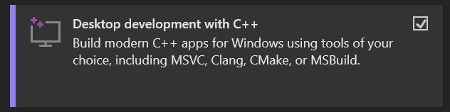 | 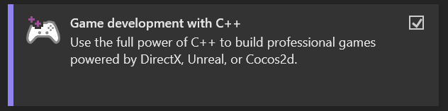 |

After this is done only clone the repository and build it.

-------------------------------

## Controls

* A/D/S/W - Move LEFT/RIGHT/BACKWARD/FORWARD
* R/F - Move UP/DOWN
* ESC - Enable/Disable free movement

-------------------------------

## Framework Overview

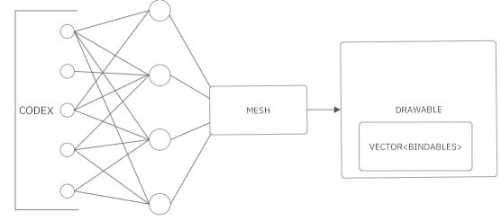

- Drawable: A base class that contains a vector of shared pointers to Bindable objects, which represent GPU resources(Vertex Buffers, Index Buffers, Constant Buffers, Shaders, etc).
- Mesh: Inherits from Drawable and represents a renderable object. It utilizes the Drawable's bindables to define its rendering behavior.
- Codex: A resource management class that maintains a map of all created Bindable objects. When a Mesh requests a Bindable, the Codex checks if it already exists, allowing for resource reuse and avoiding redundant creation.

## Features

* Geometric primitives
    - Cube
    - Pyramid
    - Tessellated Plane
    - Prism
    - Cylinder
    - UV Sphere
    - Torus
* Assimp Model Loading
* Blinn-Phong Lighting
* Normal Mapping
* Scene Graph
* Alpha Blending

## Screenshots

## 3D Primitives

### Cube
| Solid |  Wireframe |
|---|---|
|  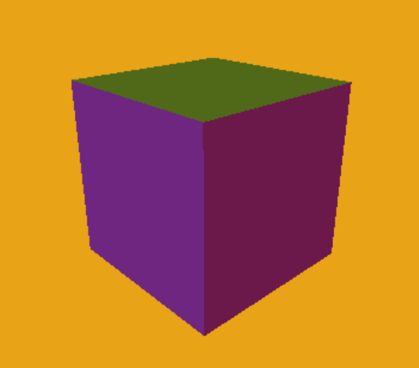 | 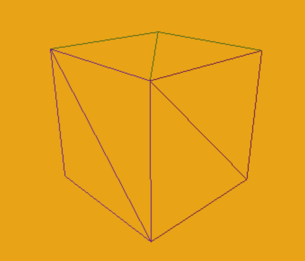 |

### Plane
| Solid |  Wireframe |
|---|---|
|   | 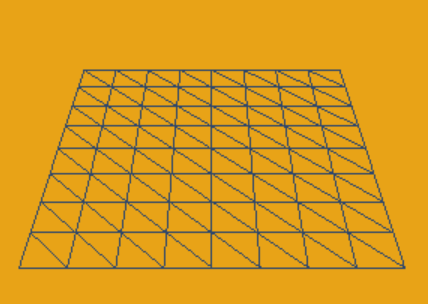 |

### Prism
| Solid |  Wireframe |
|---|---|
|   | 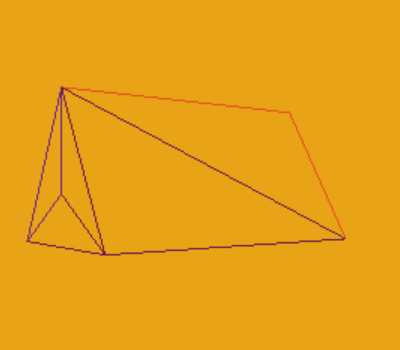 |

### Cylinder
| Solid |  Wireframe |
|---|---|
|  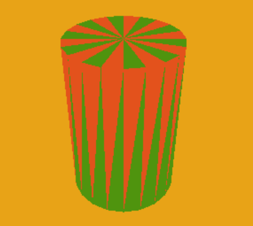 | 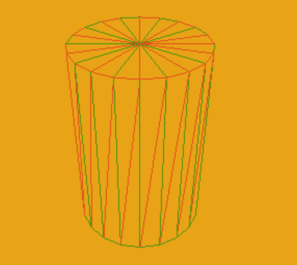 |

### UV Sphere
| Solid |  Wireframe |
|---|---|
|  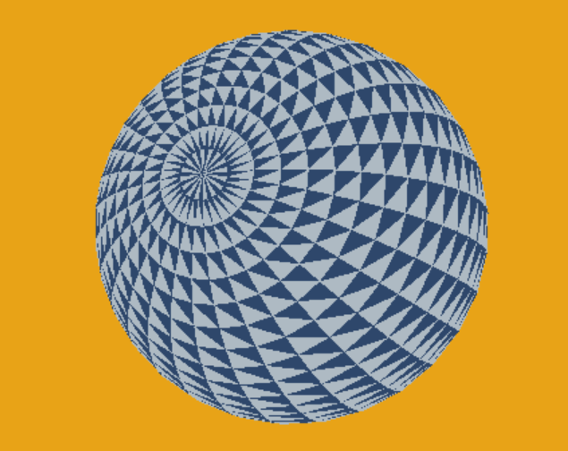 | 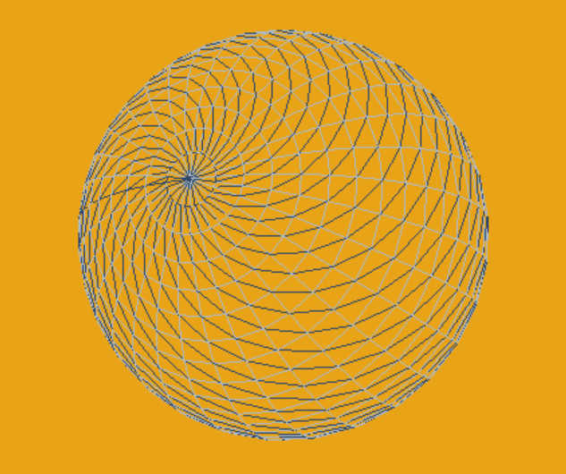 |

### Torus
| Solid |  Wireframe |
|---|---|
|   | 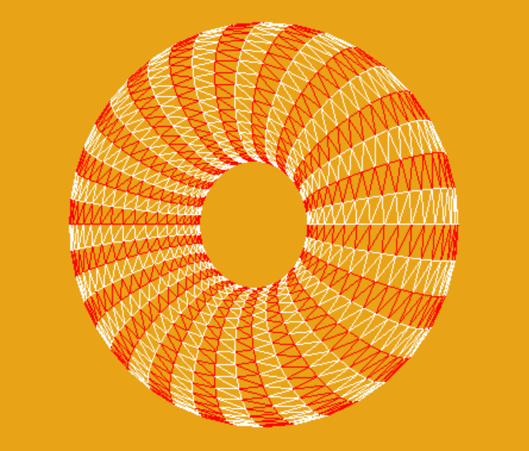 |

 

## Assimp Model Loading

| Solid |  Wireframe |
|---|---|
|  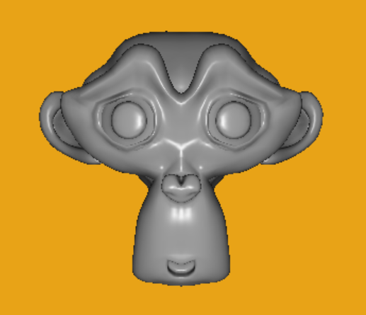 |  |

 

## Blinn-Phong Lighting
| |  |
|---|---|
|  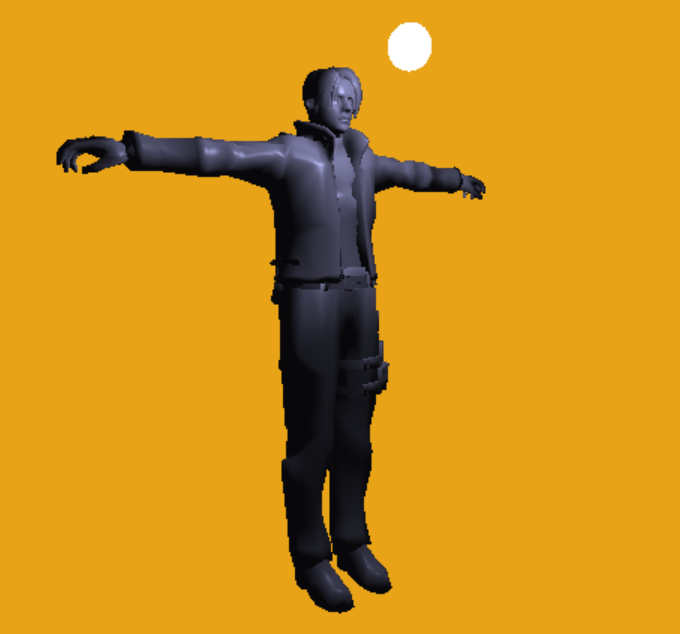 | 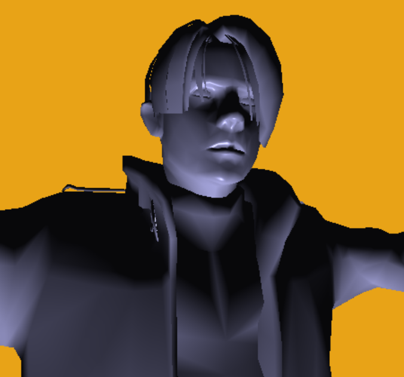 |

 

## Normal Mapping
| No NMap | With NMap |
|---|---|
|  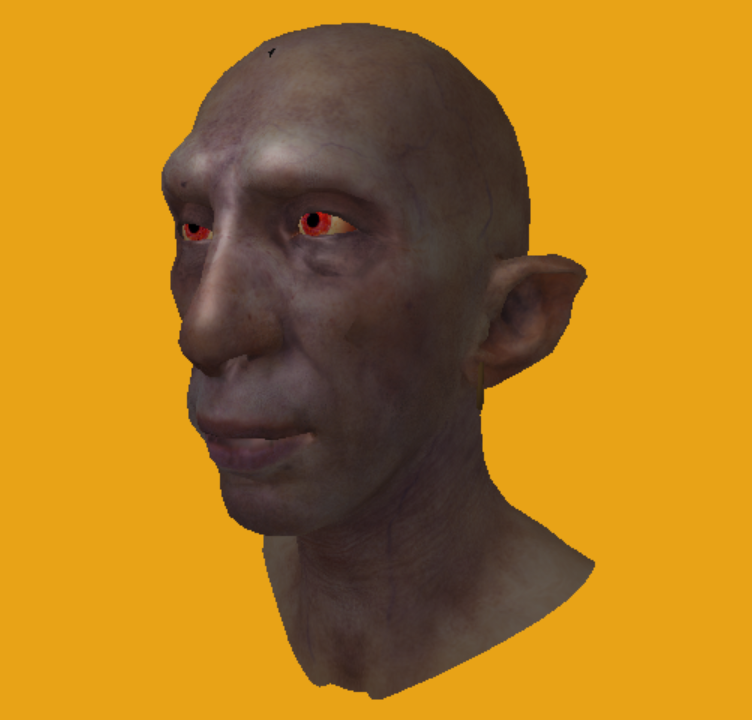 | 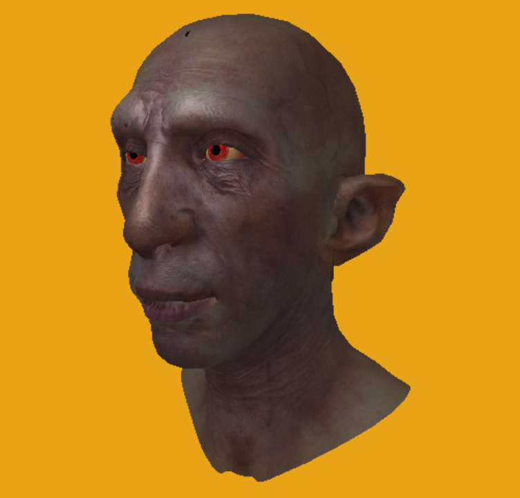 |

| No NMap/Zero Specular Power| With NMap/Zero Specular Power |
|---|---|
|  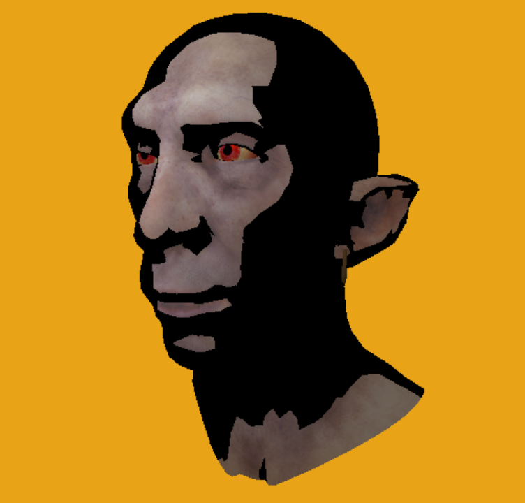 | 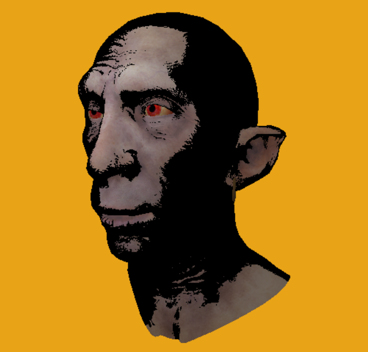 |

## Scene Graph

|Classic Sponza Scene|
|--------------------|
|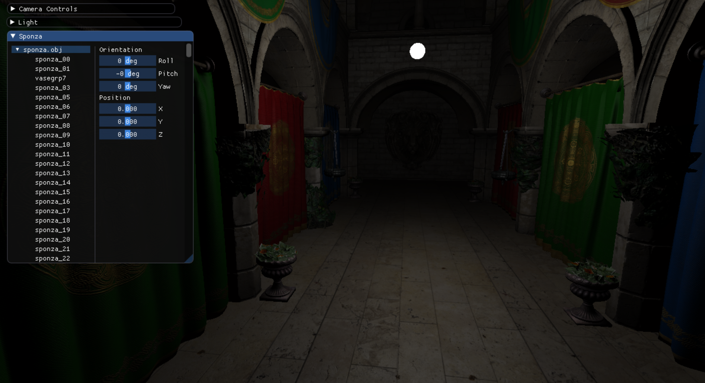|

## Anisotropic filtering

| AF OFF | AF ON |
|---|---|
|  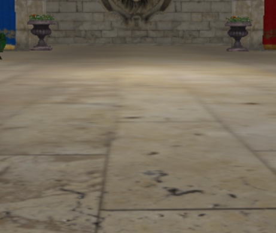 | 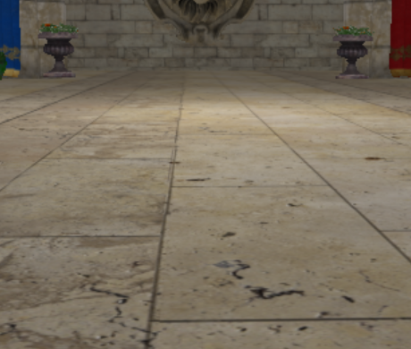 |

## Alpha Testing

| WITHOUT ALPHA TESTING | WITH ALPHA TESTING |
|---|---|
|  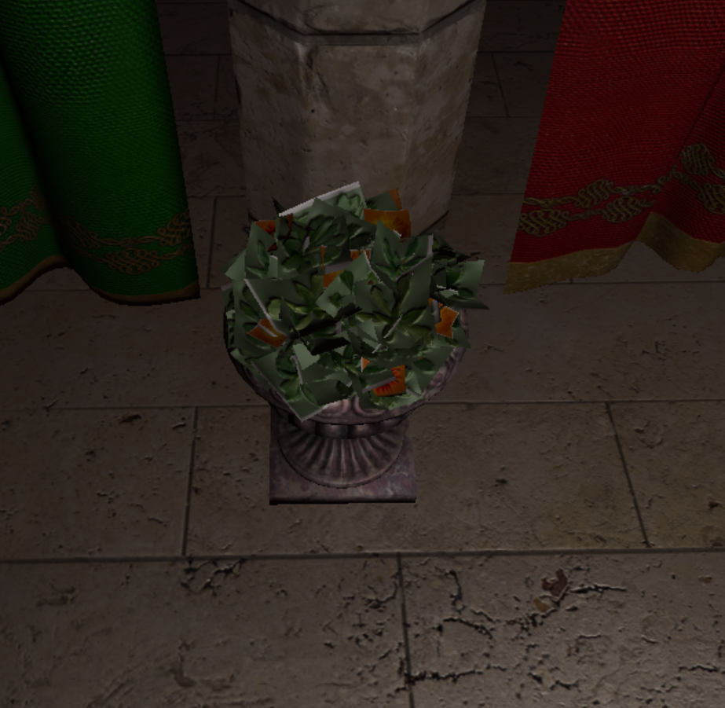 | 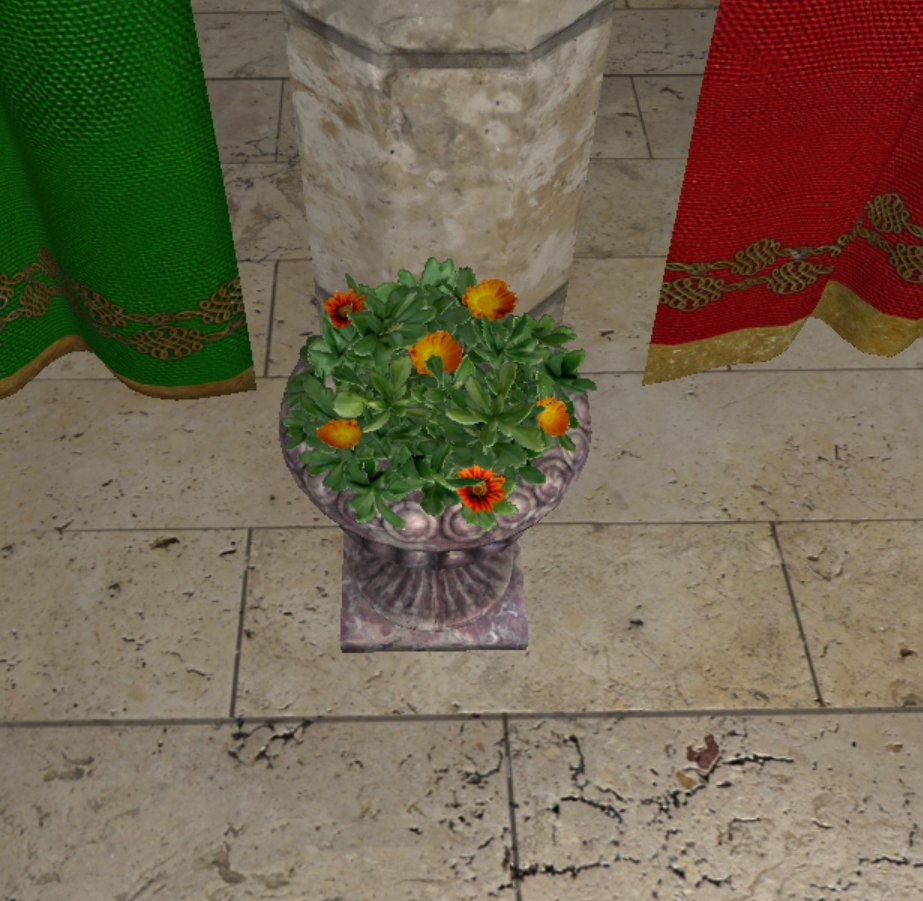 |

## Alpha Blending

|  |  |
|---|---|
|  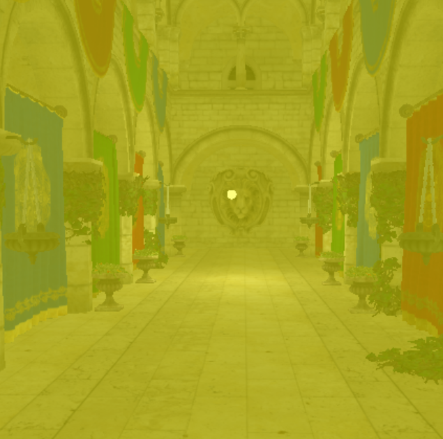 | 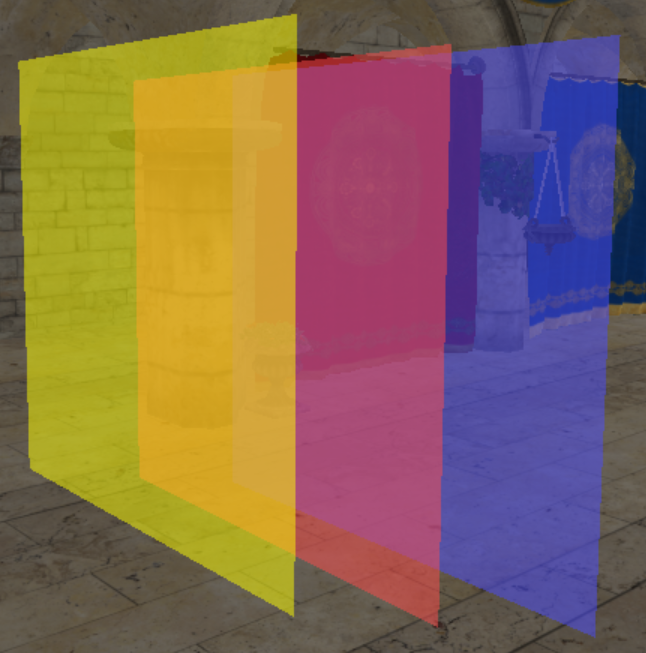 |

-------------------------------