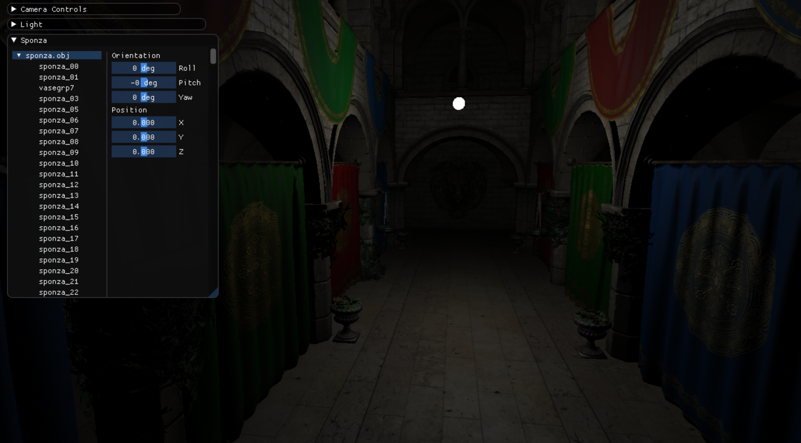

# GraphicsSandBox

## Screenshots

## 3D Primitives

### Cube
| Solid |  Wireframe |
|---|---|
|   |  |

### Plane
| Solid |  Wireframe |
|---|---|
|   |  |

### Prism
| Solid |  Wireframe |
|---|---|
|   |  |

### Cylinder
| Solid |  Wireframe |
|---|---|
|   |  |

### UV Sphere
| Solid |  Wireframe |
|---|---|
|   |  |

### Torus
| Solid |  Wireframe |
|---|---|
|   |  |

 

## Assimp Model Loading

| Solid |  Wireframe |
|---|---|
|   |  |

 

## Blinn-Phong Lighting
| |  |
|---|---|
|   |  |

 

## Normal Mapping
| No NMap | With NMap |
|---|---|
|   |  |

| No NMap/Zero Specular Power| With NMap/Zero Specular Power |
|---|---|
|   |  |

## Scene Graph

|Classic Sponza Scene|
|--------------------|
||

## Anisotropic filtering

| AF OFF | AF ON |
|---|---|
|   |  |

## Alpha Testing

| WITHOUT ALPHA TESTING | WITH ALPHA TESTING |
|---|---|
|   |  |

## Alpha Blending

|  |  |
|---|---|
|   |  |